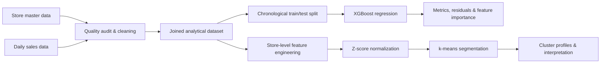

# Retail Sales Forecasting & Store Segmentation

[](https://www.knime.com/)


An end-to-end retail analytics project built in **KNIME**: audit and clean multi-source store data, forecast daily sales with **XGBoost**, explain model errors and drivers, and segment stores with **k-means**.

> **Portfolio note:** this repository documents a four-person academic team project completed for *Grundlagen der Data Science* at Technische Hochschule Mittelhessen (THM), Summer Semester 2026. The results below are taken from the submitted workflows, report and presentation; they are not reconstructed or inflated.

## At a glance

| Area | Result |
|---|---:|
| Raw daily sales records | 336,084 |
| Clean joined records | 119,905 |
| Open-store observations used for forecasting | 99,483 |
| XGBoost test R² | **0.979** |
| Mean absolute error | **921** sales units |
| Root mean squared error | **2,756** sales units |
| Mean absolute percentage error | **13.9%** |
| Stores segmented | 399 |
| k-means clusters | 3 |

## Business question

Retail teams need reliable short-term sales estimates for staffing, inventory and promotion planning. They also need to understand why stores behave differently. This project therefore addressed two connected questions:

1. How accurately can daily store sales be forecast using only information that would be available at prediction time?
2. Can stores be grouped into interpretable operating profiles based on sales, customers, volatility and promotion response?

## End-to-end approach



The original analytical work was implemented as three KNIME workflows. A small Python utility in [`scripts/profile_data.py`](scripts/profile_data.py) was added for the portfolio edition to make the dataset checks easy to reproduce outside KNIME.

## 1. Data quality and preparation

Two CSV sources were combined:

- daily store observations: date, sales, customer count, opening status, promotions and holidays;
- store master data: store type, assortment, competition distance and promotion-program attributes.

The workflow performed rule-based profiling and cleaning with KNIME nodes including **String Manipulation**, **Missing Value**, **GroupBy**, **Duplicate Row Filter**, **Row Filter** and **Joiner**.

### Quality improvements

| Dimension | Before | After |
|---|---:|---:|
| Completeness — daily sales | 98.13% | 100% |
| Completeness — store master | 79.29% | 100% |
| Uniqueness | 99.67% | 100% |
| Consistency | 99.54% | 100% |
| Implausible sales rows | 1,218 | 0 |
| Implausible customer rows | 1,018 | 0 |
| Consistency violations | 1,532 | 0 |

Important decisions included:

- standardizing 30 store-type variants into 4 valid categories, 23 assortment variants into 3 and 10 holiday variants into 4;
- removing duplicate store/date records;
- imputing missing or extreme competition distance values with medians grouped by store type and assortment;
- harmonizing `Promo2`, its start week/year and promotion intervals;
- not imputing the target variable `Sales`: rows with missing, negative or implausible targets were removed instead;
- joining the cleaned transactional and master data into a 23-column analytical table.



## 2. Sales forecasting with XGBoost

Only open-store days were modeled. The split was deliberately chronological:

- **training:** dates through 31 May 2015 — 92,592 rows;
- **test:** dates after 31 May 2015 — 6,891 rows.

This avoids learning from future observations. `Customers` was excluded because future customer counts would not be known when creating a real forecast. The technical store identifier was also excluded from the main model, and categorical variables were one-hot encoded. The final feature matrix contained 29 predictors.

### Model configuration

| Parameter | Value |
|---|---:|
| Objective | `reg:squarederror` |
| Boosting rounds | 100 |
| Learning rate (`eta`) | 0.3 |
| Maximum depth | 6 |
| L1 regularization (`alpha`) | 1 |
| L2 regularization (`lambda`) | 1 |
| Row/column subsampling | 1.0 / 1.0 |

### Test performance

| Metric | Result |
|---|---:|
| R² | **0.979** |
| Adjusted R² | **0.979** |
| MAE | **921** |
| RMSE | **2,756** |
| MAPE | **13.9%** |

The large difference between RMSE and MAE shows that a limited number of high-error observations — especially exceptional sales peaks — had a strong effect. Residual analysis also revealed differences by weekday and store type. The most influential variables included cleaned competition distance, promotion status and calendar features such as week, day and month.



## 3. Store segmentation

Store behavior was aggregated into five features:

- average sales;
- average customers;
- sales per customer;
- coefficient of variation of sales;
- promotion lift.

After excluding one extreme outlier store, 399 stores were standardized with z-scores and segmented using k-means (`k = 3`).

| Cluster | Stores | Average sales | Interpretation |
|---|---:|---:|---|
| 0 | 199 | 6,151 | Mainstream stores; separated from cluster 2 primarily by volatility and promotion response |
| 1 | 99 | 9,472 | Clearly higher-sales stores |
| 2 | 101 | 6,100 | Similar average sales to cluster 0 but a different behavioral profile |

The silhouette coefficient was approximately **0.248**. This modest value is reported transparently: the high-sales group is distinct, while clusters 0 and 2 overlap more strongly. A natural next experiment is to compare global forecasting with cluster-specific models.



## Repository structure

```text
.
├── assets/       # Exported workflow diagrams
├── data/         # Schema and instructions; full course data is not redistributed
├── docs/         # Submitted report and project presentation
├── results/      # Detailed metrics and modeling decisions
├── scripts/      # Reproducible Python data-profile utility
└── workflows/    # Importable KNIME .knwf packages
```

## Reproduce the analysis

1. Install a current version of [KNIME Analytics Platform](https://www.knime.com/downloads).
2. Import the three `.knwf` files from [`workflows/`](workflows/).
3. Place the source CSV files locally. Their expected schemas are documented in [`data/README.md`](data/README.md).
4. Reconfigure the first **CSV Reader** nodes because the submitted workflows retain the original local file paths.
5. Run the workflows in order: data quality → forecasting → clustering.
6. Optionally verify the input/output profiles with the Python helper:

```bash
python -m pip install -r requirements.txt
python scripts/profile_data.py \
  --stores path/to/filialen.csv \
  --sales path/to/filialumsatz.csv \
  --clean path/to/clean_retail_sales.csv
```

## What this project demonstrates

- systematic data-quality assessment and rule-based cleansing;
- feature engineering across transactional and master data;
- leakage-aware, time-ordered model evaluation;
- gradient-boosted regression with XGBoost;
- model evaluation through multiple metrics and residual analysis;
- unsupervised learning and critical interpretation of cluster quality;
- documentation of analytical decisions, limitations and next steps.

## Kurzfassung auf Deutsch

In diesem Hochschulprojekt wurde eine vollständige Retail-Analytics-Pipeline in KNIME entwickelt. Zwei Datenquellen wurden geprüft, bereinigt und zusammengeführt. Ein XGBoost-Modell prognostiziert Filialumsätze auf einem zeitlich getrennten Testdatensatz mit einem **R² von 0,979** und einem **MAPE von 13,9 %**. Ergänzend wurden 399 Filialen anhand von Umsatz, Kundenverhalten, Schwankung und Promotion-Effekt mit k-means in drei Profile segmentiert. Besonderer Wert wurde auf Datenqualität, die Vermeidung von Data Leakage und eine ehrliche Interpretation der Modellgrenzen gelegt.

## Team and academic context

Completed at THM in Summer Semester 2026 by **Kana Tezo, Moumani Tchokote, Pokem Tezo and Mamo Tiotsap**, supervised by Prof. Frank Kammer. See the [project report](docs/project-report.pdf) and [presentation](docs/project-presentation.pdf) for the submitted documentation.

## Data availability

The complete course datasets are intentionally not published because no redistribution license was included with the supplied files. This repository provides the executable workflows, documentation, schemas and validation code without claiming ownership of the underlying dataset.
