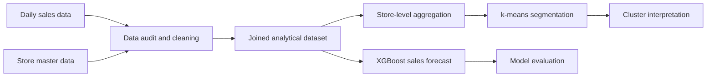

# Retail Sales Forecasting & Store Segmentation

[](https://www.knime.com/)


This university project examines the sales activity of a retail chain. The starting point was two CSV files: one containing daily sales observations for individual stores and another describing the stores themselves. Our task was to clean and combine these sources, forecast daily sales, and investigate whether stores with similar behaviour could be grouped into meaningful profiles.

We completed the project as a four-person team for the **Grundlagen der Data Science** course at Technische Hochschule Mittelhessen (THM) in the Summer Semester 2026. The analysis was built in **KNIME** and divided into three workflows: data quality, sales forecasting with XGBoost, and store segmentation with k-means.

## The data

The two source files describe different parts of the same retail business:

| File | Content | Initial size |
|---|---|---:|
| `filialumsatz.csv` | One observation per store and day: date, sales, customer count, opening status, promotions, and holidays | 336,084 rows, 9 columns |
| `filialen.csv` | Store information: store type, assortment, distance to the nearest competitor, and participation in a long-term promotion programme | 406 rows, 10 columns |

The daily observations cover the period from **January 2013 to July 2015**. Before the data could be used, we had to deal with missing values, duplicate store/date records, inconsistent category names, invalid sales and customer values, and incomplete store information.

After cleaning and joining both sources, the analytical dataset contained **119,905 rows and 23 columns** with no remaining missing values. Of these, **99,483 observations from open-store days** were used for sales forecasting.

The original course data is not included in this public repository. Its structure is documented in [`data/README.md`](data/README.md).

## What we wanted to find out

The project focused on two questions:

1. Can daily store sales be predicted from information that is already known when the prediction is made?
2. Can stores be grouped according to their sales level, customer behaviour, volatility, and response to promotions?

These questions led to the following pipeline:



## 1. Preparing the data

The first KNIME workflow profiles both files, applies the cleaning rules, and joins them by store ID. We used nodes such as **String Manipulation**, **Missing Value**, **GroupBy**, **Duplicate Row Filter**, **Row Filter**, and **Joiner**.

The main preparation steps were:

- normalising 30 spellings of the store type into 4 categories;
- normalising 23 assortment values into 3 categories and 10 holiday values into 4;
- removing duplicate store/date observations;
- replacing missing or extreme competition distances with group medians based on store type and assortment;
- making the `Promo2` fields consistent with the promotion status of each store;
- removing rows with missing, negative, or implausible sales instead of estimating the target variable;
- combining the cleaned daily observations with the store information.

| Quality check | Before cleaning | After cleaning |
|---|---:|---:|
| Completeness of daily sales data | 98.13% | 100% |
| Completeness of store data | 79.29% | 100% |
| Uniqueness | 99.67% | 100% |
| Consistency | 99.54% | 100% |
| Implausible sales rows | 1,218 | 0 |
| Implausible customer rows | 1,018 | 0 |
| Consistency violations | 1,532 | 0 |


## 2. Forecasting daily sales

For the forecasting task, we kept only days on which a store was open. The data was split by date rather than randomly so that the model was evaluated on observations that occurred after its training period:

- **training set:** all dates up to 31 May 2015 — 92,592 rows;
- **test set:** all later dates — 6,891 rows.

We excluded `Customers` because the number of future customers would not be available when producing a real sales forecast. The store ID and the constant `Open` column were also left out. After one-hot encoding the categorical variables, the XGBoost model used 29 predictors.

### XGBoost configuration

| Parameter | Value |
|---|---:|
| Objective | `reg:squarederror` |
| Boosting rounds | 100 |
| Learning rate (`eta`) | 0.3 |
| Maximum depth | 6 |
| L1 regularisation (`alpha`) | 1 |
| L2 regularisation (`lambda`) | 1 |
| Row and column subsampling | 1.0 / 1.0 |

### Results on the test period

| Metric | Result |
|---|---:|
| R² | **0.979** |
| Adjusted R² | **0.979** |
| Mean absolute error | **921** |
| Root mean squared error | **2,756** |
| Mean absolute percentage error | **13.9%** |

The difference between MAE and RMSE showed that a small number of large errors had a noticeable effect on the model, especially around unusual sales peaks. We therefore looked beyond the overall score and compared residuals by weekday and store type. Promotion status, competition distance, and calendar variables such as week, day, and month were among the most influential predictors.


## 3. Segmenting the stores

The final workflow changes the level of analysis from individual days to stores. For every store, we calculated five characteristics:

- average sales;
- average number of customers;
- sales per customer;
- coefficient of variation of sales;
- sales uplift during promotions.

After removing one store with extreme values, the five characteristics were standardised as z-scores. We then used **k-means with three clusters** to segment the remaining 399 stores.

| Cluster | Number of stores | Average sales | Main characteristic |
|---|---:|---:|---|
| 0 | 199 | 6,151 | Medium-sales stores with a particular volatility and promotion-response pattern |
| 1 | 99 | 9,472 | Stores with clearly higher average sales |
| 2 | 101 | 6,100 | Similar average sales to cluster 0, but different volatility and promotion behaviour |

The silhouette coefficient was approximately **0.248**. The high-sales cluster was clearly identifiable, while clusters 0 and 2 overlapped more strongly. This suggests that the segmentation is useful as an exploratory view of store behaviour, but that the two medium-sales groups should not be treated as sharply separated customer segments.


## Project results

| Stage | Result |
|---|---:|
| Clean joined observations | 119,905 |
| Open-store observations used for forecasting | 99,483 |
| XGBoost test R² | 0.979 |
| XGBoost test MAPE | 13.9% |
| Stores included in the clustering | 399 |
| Store clusters | 3 |

The project gave us practical experience in turning imperfect source files into a complete analytical workflow: defining data-quality rules, preventing target leakage, evaluating a regression model on future observations, engineering store-level features, and interpreting the limits of a clustering result.

## Repository structure

```text
.
├── assets/       # Diagrams of the three KNIME workflows
├── data/         # Source-file schemas and local setup instructions
├── docs/         # Project report and presentation
├── results/      # Detailed metrics and modelling decisions
├── scripts/      # Python utility for checking the dataset profiles
└── workflows/    # Importable KNIME workflow packages
```

## Running the workflows

1. Install [KNIME Analytics Platform](https://www.knime.com/downloads).
2. Import the three `.knwf` files from [`workflows/`](workflows/).
3. Add the two source CSV files locally according to [`data/README.md`](data/README.md).
4. Update the first **CSV Reader** node in each workflow because the submitted workflows contain the original local paths.
5. Run the workflows in this order: data quality, sales forecasting, then store clustering.

The optional Python script can be used to inspect the input and output files outside KNIME:

```bash
python -m pip install -r requirements.txt
python scripts/profile_data.py \
  --stores path/to/filialen.csv \
  --sales path/to/filialumsatz.csv \
  --clean path/to/clean_retail_sales.csv
```

## Limitations and possible next steps

- The dataset ends in July 2015 and does not represent current retail conditions.
- The forecast was evaluated with one chronological holdout period. Rolling-window validation would provide a more complete view of its stability over time.
- Local events and other factors that may affect an individual store are not available in the source data.
- Two of the three store clusters overlap. Other feature sets or clustering methods could be compared.
- A useful follow-up experiment would be to compare the global XGBoost model with separate models for each store cluster.

## Team and academic context

The project was developed at THM in the Summer Semester 2026 by **Kana Tezo, Moumani Tchokote, Pokem Tezo, and Mamo Tiotsap**, under the supervision of **Prof. Frank Kammer**.

The submitted [project report](docs/project-report.pdf) and [presentation](docs/project-presentation.pdf) are included in the repository.
